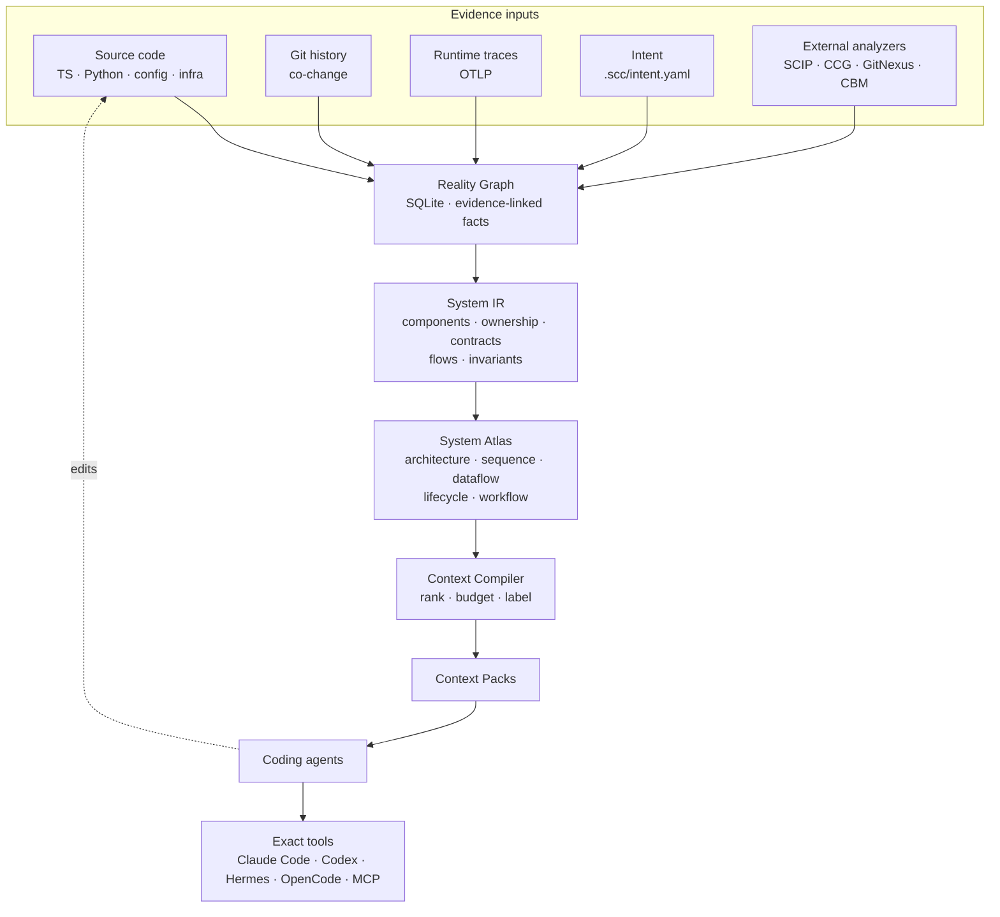

# System Context Compiler

**Compile repositories into evidence-backed system context for coding agents.**

> Give agents more repository understanding per token, not more repository text.

SCC continuously compiles code, configuration, infrastructure, runtime
evidence, tests, and declared architectural intent into a **verified machine
model of the software system** — then emits small, task-specific context
packs so AI coding agents start every task with correct system understanding
instead of rediscovering it through search.

**Status:** Phases 1–11 implemented · 290 tests · recall 1.000 on the
ground-truth benchmark · local-first, no telemetry, no source egress.

---

## Why

Coding agents face a repository-context problem. Options today trade off
accuracy, cost, and relevance:

| Approach | Problem |
|---|---|
| Dump lots of source code | expensive, context-flooding, mostly irrelevant |
| Search + navigation tools | the agent must know what to search for, burns turns reconstructing the system |
| Code graphs | precise but low-level — they don't say how the *system* works |
| Architecture docs | for humans, often stale, not a machine reasoning substrate |

SCC is the missing layer: a **continuously compiled, evidence-linked system
model** (the System IR) and a **context compiler** that turns it into exactly
the slice an agent needs for the task at hand.

## How it works



The authority chain is strict:

```text
runtime observation + compiler/LSP facts > deterministic extraction
> declared architecture > high-confidence inference > memory > model assumption
```

Every fact carries a provenance class — `EXTRACTED`, `RESOLVED`, `OBSERVED`,
`DECLARED`, `INFERRED`, `STALE` — with evidence pointing at the exact
file/line/revision that supports it. Inferred claims are labeled and never
silently trusted; stale facts are excluded from trusted context.

## Features

- **Reality Graph** — tree-sitter extractors for Python and TypeScript
  (symbols, imports, calls, routes, tests, store access), cross-file call
  resolution with `src/`/`svc/`/`lib/` layout fallbacks, incremental
  invalidation with full↔incremental equivalence guarantees.
- **System IR** — component compiler (workspaces, deployment units,
  directories, intent), ownership, contracts, invariants.
- **System Atlas** — machine-readable architecture, sequence, dataflow,
  lifecycle, and workflow views. No colors, no coordinates — semantics only.
- **Behavioral semantics** — retry/fallback/DLQ/circuit-breaker detection,
  config references, trust boundaries, Git co-change.
- **Context Compiler** — six agent-facing operations with hard token
  budgets that never cut invariants, ownership, or failure behavior:
  `system_overview`, `task_context`, `component_context`, `flow_context`,
  `impact_context`, `verify_context`.
- **Semantic precision** — LSP definition resolution (pyright +
  typescript-language-server) with a resolution-conflict model, SCIP
  import, and a native-vs-LSP differential benchmark.
- **Optional semantic ranking** — embeddings via any OpenAI-compatible
  endpoint (Ollama, OpenAI, gateways) fused into ranking, plus a separate
  `/rerank` model; degrades gracefully to lexical when offline.
- **Runtime reconciliation** — OpenTelemetry trace ingestion, static-vs-
  observed edge comparison, replay-verified aggregates.
- **Freshness & drift** — content-hash invalidation, staleness detection,
  intent↔reality drift, CI gates (`scc ci check`).
- **Security** — local-first, secret redaction, path sandbox, untrusted-text
  labeling, adapter capability manifests.
- **Integrations** — Claude Code hooks, Codex AGENTS.md, OpenCode MCP
  config, Hermes plugin, MCP server (6 tools), HTTP API, TypeScript and
  Python SDKs, Beads/CBM/Hindsight/Context7 adapters.

## Quickstart

```bash
cargo build --release -p scc-cli          # → target/release/scc

cd /path/to/your/repo
scc init                                  # .scc/config.yaml + database
scc index                                 # cold index; incremental afterwards
scc overview                              # startup capsule
scc context task "change transcript normalization"
scc setup claude                          # automatic Claude Code hooks
```

### The six agent-facing operations

| Tool | Purpose |
|---|---|
| `system_overview` | system purpose, components, boundaries, stores, externals, flows, invariants, freshness |
| `task_context` | bounded task pack: targets, flows, up/downstream, ownership, contracts, invariants, failures, implementation, tests, evidence status |
| `component_context` | responsibility, implementation, deps, ownership, flows, contracts, tests |
| `flow_context` | trigger, steps, branches, data, failures, retries, evidence |
| `impact_context` | affected components/flows/consumers/contracts/data/invariants/tests + risk |
| `verify_context` | freshness, stale facts, graph invariants, drift, low-confidence deps |

## CLI reference

```bash
scc init | index [--paths ...] | status | watch
scc overview [--json]
scc context task <goal> [--files ...] [--symbols ...] [--budget N] [--json]
scc context component <id> | flow <id> | subagent <goal> | compress <goal> [--cmd ...] [--claims]
scc context docs <owner/name>          # external docs via Context7 (labeled)
scc impact [--diff HEAD~1] [files...]
scc verify [--warnings] [--json]
scc drift [--json]
scc ci check [--max-severity medium]   # CI gate
scc export system-ir.json | jsonl | ccg | capsule.md
scc import scip|ccg|gitnexus|beads|cbm|hindsight <file>
scc resolve --lsp                       # LSP semantic resolution (pyright/tsserver)
scc embed                               # compute embeddings (opt-in ranker)
scc bench context [--min-recall 0.9]    # ground-truth context benchmark
scc bench resolution                    # native-vs-LSP differential benchmark
scc bench agent --cmd <agent-cmd>       # agent-run recorder (M0)
scc bench index [--files N] [--lines N] # latency benchmark
scc runtime status | reconcile          # observed edges + static comparison
scc cochange [--min-commits N]          # git co-change pairs
scc adapters                            # adapter capability manifests
scc query <terms> | checkpoint save|load
scc setup claude | codex | opencode | hermes
scc serve | mcp | ingest '<json>'
```

## Interfaces

- **MCP server** — `scc mcp` (stdio, newline-delimited JSON-RPC): exactly the
  six semantic tools, repository read-only.
- **HTTP API** — `scc serve` implements `docs/openapi.yaml` on
  `127.0.0.1:7777` (loopback only by default): `/v1/system`,
  `/v1/context/task`, `/v1/components/{id}`, `/v1/flows/{id}`,
  `/v1/impact`, `/v1/verify`, `/v1/index`, `/v1/index/status`,
  `/v1/runtime/traces`.
- **SDKs** — TypeScript (`sdk/typescript`, `@scc/sdk`) and Python
  (`sdk/python`, `scc-sdk`) wrapping the CLI.
- **Agent harnesses** — Claude Code hooks (SessionStart, UserPromptSubmit,
  PostToolUse, PreCompact + checkpoint rehydration), Codex AGENTS.md,
  OpenCode MCP config, Hermes native plugin.

## Configuration

```yaml
# .scc/config.yaml
schema: 1
index:
  ignore: [vendor/**, generated/**]
context:
  startup_tokens: 6000
  task_tokens: 10000
inference:                     # optional semantic ranker
  enabled: false
  provider: local              # local = ollama; openai; endpoint
  embedding_model: nomic-embed-text
  rerank_model: ""             # separate /rerank model (Cohere/Jina style)
  base_url: ""
  api_key_env: ""
integrations:
  context7_command: ""         # e.g. 'npx -y @upstash/context7-mcp'
  hindsight: false
security:
  listen: 127.0.0.1:7777
```

See `docs/config.example.yaml` for the full file.

## Benchmarks

| Benchmark | Result | Target |
|---|---|---|
| Task-context recall (21 tasks / 8 repos) | **1.000** | ≥ 0.95 |
| Task-context localization | **1.000** | — |
| Hallucination violations | **0** | 0 |
| Cold index 250k LOC | 96.5 s | < 120 s |
| Peak RSS 250k LOC | 217 MiB | < 2 GB |
| Incremental P95 250k LOC | 92.4 s | — |
| Task pack generation | ~70 ms | < 500 ms |
| Differential resolution conflicts | 0 | 0 |

Run them yourself:

```bash
scc bench context --min-recall 0.9
scc bench resolution
scc bench index --files 1000 --lines 250    # ~10 min
cargo test -p scc-cli --test perf cold_index_250k -- --ignored
```

## Repository layout

```text
crates/            Rust workspace
  scc-core/        System IR types, provenance, identifiers, token budgeting
  scc-store/       SQLite persistence (WAL + FTS5), migrations, snapshots
  scc-indexer/     scanning, extractors (TS/Python/infra), LSP, adapters
  scc-graph/       components, flows, invariants, boundaries, co-change
  scc-context/     ranking, expansion, budgets, pack rendering
  scc-cli/         CLI, daemon, MCP, plugins, benchmarks
adapters/          external evidence importers (beads, cbm, hindsight, context7)
sdk/               TypeScript + Python SDKs
plugins/           hermes plugin package
fixtures/          8 golden repositories with ground-truth expectations
benchmarks/        tasks.json — 21 ground-truth tasks + hallucination probes
docs/              the full specification this implements
```

## Documentation

The complete specification lives in `docs/` — every implementation decision
traces back to it:

| Document | Contents |
|---|---|
| [docs/PRD.md](docs/PRD.md) | problem, goals, functional requirements, success metrics |
| [docs/SYSTEM_DESIGN.md](docs/SYSTEM_DESIGN.md) | architecture, modules, authority model |
| [docs/SYSTEM_IR_SCHEMA.md](docs/SYSTEM_IR_SCHEMA.md) | entities, relationships, provenance, invariants |
| [docs/system-ir.schema.json](docs/system-ir.schema.json) | machine-validated export schema |
| [docs/CONTEXT_COMPILER.md](docs/CONTEXT_COMPILER.md) | context levels, ranking, budgets, pack format |
| [docs/FLOW_COMPILER.md](docs/FLOW_COMPILER.md) | sequence/dataflow/lifecycle compilation |
| [docs/API_AND_INTEGRATIONS.md](docs/API_AND_INTEGRATIONS.md) | MCP/HTTP/CLI/SDK contracts, harness integrations |
| [docs/DATA_STRATEGY.md](docs/DATA_STRATEGY.md) | storage layers, freshness, incremental indexing |
| [docs/TEST_PLAN.md](docs/TEST_PLAN.md) | test strategy, benchmarks, quality gates |
| [docs/SECURITY.md](docs/SECURITY.md) | threat model, trust boundaries, sandboxing |
| [docs/DEPLOYMENT_AND_INFRA.md](docs/DEPLOYMENT_AND_INFRA.md) | deployment modes, Docker, observability |
| [docs/IMPLEMENTATION_PLAN.md](docs/IMPLEMENTATION_PLAN.md) | phases 0–12 and the MVP cut |
| [docs/MILESTONES.md](docs/MILESTONES.md) · [docs/EPICS_AND_TICKETS.md](docs/EPICS_AND_TICKETS.md) | M0–M10, per-ticket status |
| [docs/openapi.yaml](docs/openapi.yaml) | HTTP API contract |

## Development

```bash
cargo test --workspace        # 290 tests: extractors, golden repos,
                              # equivalence, LSP, proptest, benchmarks
cargo clippy --workspace -- -D warnings
```

See [CONTRIBUTING.md](CONTRIBUTING.md) for the full development guide —
extractor contracts, adapter writing, benchmark methodology, and the CI
gates.

## Security

Local-first by default: source never leaves the machine, the daemon binds
loopback only, and remote inference is opt-in with visible egress.
Repository text is treated as untrusted data; secrets are redacted before
persistence; adapter capabilities are declared and enforced. See
[SECURITY.md](SECURITY.md) and the full [threat model](docs/SECURITY.md).

## License

MIT — see [LICENSE](LICENSE).
